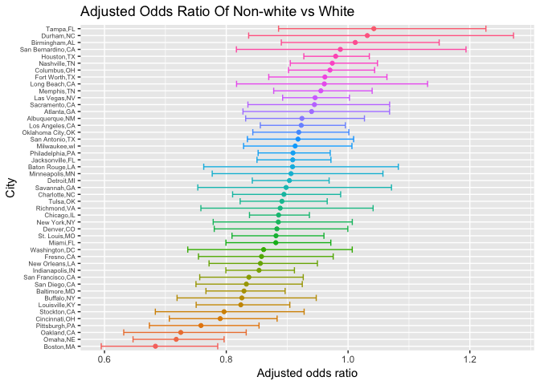
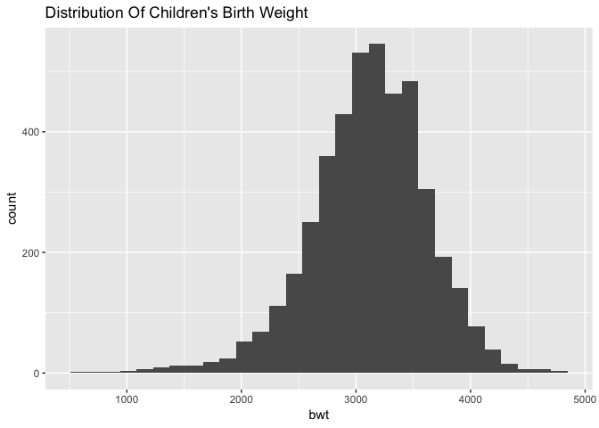
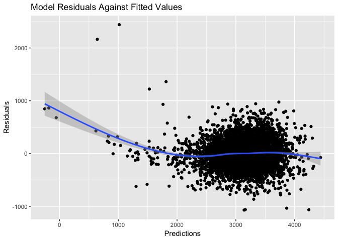
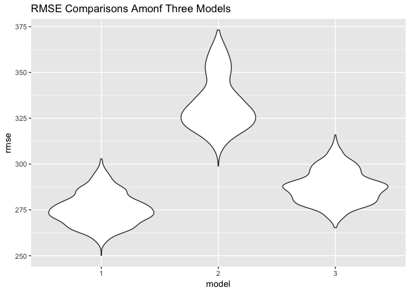

P8105\_hw6\_jl5172
================

    ## ── Attaching packages ───────────────────────────────────────────────────────── tidyverse 1.2.1 ──

    ## ✔ ggplot2 3.0.0     ✔ purrr   0.2.5
    ## ✔ tibble  1.4.2     ✔ dplyr   0.7.8
    ## ✔ tidyr   0.8.1     ✔ stringr 1.3.1
    ## ✔ readr   1.1.1     ✔ forcats 0.3.0

    ## ── Conflicts ──────────────────────────────────────────────────────────── tidyverse_conflicts() ──
    ## ✖ dplyr::filter() masks stats::filter()
    ## ✖ dplyr::lag()    masks stats::lag()

Question 1

``` r
homicide<-read.csv("homicide-data.csv")
homicide<-homicide %>% 
  mutate(city_state=str_c(city,state,sep=",")) %>% 
  dplyr::filter(city_state!="Dallas,TX",city_state!="Phoenix,AZ",city_state!="Kansas City,MO",city_state!="Tulsa,AL") %>% 
  mutate(resolved=ifelse(disposition=="Closed by arrest",T,F)) %>% 
  mutate(victim_age=as.numeric(victim_age)) %>% 
  mutate(victim_race = tolower(victim_race)) %>% 
  mutate(victim_race =ifelse(victim_race=="white","white","non-white")) %>% 
  mutate(victim_race = fct_relevel(victim_race, "white"))
```

Baltimore, MD, use the glm function to fit a logistic regression with resolved vs unresolved as the outcome and victim age, sex and race (as just defined) as predictors.

``` r
baltimore<-
  homicide %>% 
  filter(city_state=="Baltimore,MD") 
baltimore_glm = glm(resolved ~ victim_race + victim_age + victim_sex, 
                    data = baltimore, family = binomial())

baltimore_glm %>% 
  broom::tidy() %>% 
  mutate(odds_ratio = exp(estimate),
         conf_low = exp(estimate - std.error * 1.96),
         conf_high = exp(estimate + std.error * 1.96)) %>% 
  filter(term=="victim_racenon-white") %>% 
  dplyr::select(term,odds_ratio,conf_low,conf_high)  %>% 
   knitr::kable(digits = 3) 
```

| term                  |  odds\_ratio|  conf\_low|  conf\_high|
|:----------------------|------------:|----------:|-----------:|
| victim\_racenon-white |        0.453|      0.322|       0.637|

Run glm for each of the cities in dataset,extract the adjusted odds ratio (and CI) for solving homicides comparing non-white victims to white victims. Do this within a “tidy” pipeline, making use of purrr::map, list columns, and unnest as necessary to create a dataframe with estimated ORs and CIs for each city.

``` r
cities_glm = homicide %>% 
  group_by(city_state) %>% 
  nest() %>% 
  mutate(models = map(data, ~glm(resolved ~ victim_race + victim_age + victim_sex, data = .x)),
         models = map(models, broom::tidy)) %>% 
  dplyr::select(-data) %>% 
  unnest() %>% 
  mutate(odds_ratio = exp(estimate),
        conf_low = exp(estimate - std.error * 1.96),
         conf_high = exp(estimate + std.error * 1.96)) %>% 
  filter(term == "victim_racenon-white") %>% 
  dplyr::select(city_state,odds_ratio,conf_low,conf_high)
  
  
 cities_glm %>% 
   knitr::kable()
```

| city\_state       |  odds\_ratio|  conf\_low|  conf\_high|
|:------------------|------------:|----------:|-----------:|
| Albuquerque,NM    |    0.9242456|  0.8318479|   1.0269063|
| Atlanta,GA        |    0.9401151|  0.8274240|   1.0681542|
| Baltimore,MD      |    0.8290792|  0.7665947|   0.8966569|
| Baton Rouge,LA    |    0.9088152|  0.7629893|   1.0825120|
| Birmingham,AL     |    1.0117438|  0.8904017|   1.1496221|
| Boston,MA         |    0.6836436|  0.5946612|   0.7859408|
| Buffalo,NY        |    0.8255924|  0.7191927|   0.9477332|
| Charlotte,NC      |    0.8947278|  0.8104147|   0.9878127|
| Chicago,IL        |    0.8859383|  0.8381081|   0.9364981|
| Cincinnati,OH     |    0.7900229|  0.7064509|   0.8834813|
| Columbus,OH       |    0.9703275|  0.9022106|   1.0435873|
| Denver,CO         |    0.8831390|  0.7802473|   0.9995991|
| Detroit,MI        |    0.9036100|  0.8427333|   0.9688843|
| Durham,NC         |    1.0315499|  0.8367549|   1.2716928|
| Fort Worth,TX     |    0.9619012|  0.8697385|   1.0638300|
| Fresno,CA         |    0.8578623|  0.7543360|   0.9755967|
| Houston,TX        |    0.9796733|  0.9273750|   1.0349208|
| Indianapolis,IN   |    0.8537630|  0.7993153|   0.9119195|
| Jacksonville,FL   |    0.9091374|  0.8504500|   0.9718746|
| Las Vegas,NV      |    0.9458211|  0.8925344|   1.0022892|
| Long Beach,CA     |    0.9610146|  0.8169028|   1.1305494|
| Los Angeles,CA    |    0.9231053|  0.8559063|   0.9955801|
| Louisville,KY     |    0.8238683|  0.7505541|   0.9043439|
| Memphis,TN        |    0.9552940|  0.8778622|   1.0395556|
| Miami,FL          |    0.8813453|  0.7994171|   0.9716699|
| Milwaukee,wI      |    0.9130805|  0.8284433|   1.0063645|
| Minneapolis,MN    |    0.9063280|  0.7769384|   1.0572659|
| Nashville,TN      |    0.9740692|  0.9050824|   1.0483142|
| New Orleans,LA    |    0.8560779|  0.7717294|   0.9496454|
| New York,NY       |    0.8854058|  0.7785325|   1.0069501|
| Oakland,CA        |    0.7252396|  0.6316197|   0.8327360|
| Oklahoma City,OK  |    0.9190565|  0.8435716|   1.0012961|
| Omaha,NE          |    0.7177685|  0.6468737|   0.7964332|
| Philadelphia,PA   |    0.9095619|  0.8522952|   0.9706765|
| Pittsburgh,PA     |    0.7584383|  0.6737248|   0.8538037|
| Richmond,VA       |    0.8885378|  0.7583138|   1.0411250|
| San Antonio,TX    |    0.9177812|  0.8347185|   1.0091095|
| Sacramento,CA     |    0.9447559|  0.8355404|   1.0682472|
| Savannah,GA       |    0.8982980|  0.7532387|   1.0712929|
| San Bernardino,CA |    0.9873181|  0.8166252|   1.1936897|
| San Diego,CA      |    0.8329608|  0.7502479|   0.9247926|
| San Francisco,CA  |    0.8371006|  0.7564110|   0.9263977|
| St. Louis,MO      |    0.8816586|  0.8093895|   0.9603805|
| Stockton,CA       |    0.7963673|  0.6835124|   0.9278557|
| Tampa,FL          |    1.0422915|  0.8858484|   1.2263628|
| Tulsa,OK          |    0.8914161|  0.8228045|   0.9657491|
| Washington,DC     |    0.8612852|  0.7367562|   1.0068625|

Create a plot that shows the estimated ORs and CIs for each city. Organize cities according to estimated OR, and comment on the plot.

``` r
cities_glm %>% ggplot(aes(color = reorder(city_state, odds_ratio))) +
  geom_point(aes(x = reorder(city_state, odds_ratio), y = odds_ratio)) +
  geom_errorbar(aes(x = city_state, ymin = conf_low, ymax = conf_high)) +
  coord_flip() + ggtitle("Adjusted Odds Ratio Of Non-white vs White") +
  xlab("City") + ylab("Adjusted odds ratio") + 
  theme(axis.text.y = element_text(size = 6), legend.position = "none") 
```



Question 2

``` r
library(broom)
library(dplyr)
library(leaps)
library(HH)
```

``` r
birth<-read.csv("birthweight.csv") #Load and clean data
skimr::skim(birth) # There is no missing data
```

    ## Skim summary statistics
    ##  n obs: 4342 
    ##  n variables: 20 
    ## 
    ## ── Variable type:integer ─────────────────────────────────────────────────────────────────────────
    ##  variable missing complete    n      mean      sd  p0  p25    p50  p75
    ##   babysex       0     4342 4342    1.49     0.5     1    1    1      2
    ##     bhead       0     4342 4342   33.65     1.62   21   33   34     35
    ##   blength       0     4342 4342   49.75     2.72   20   48   50     51
    ##       bwt       0     4342 4342 3114.4    512.15  595 2807 3132.5 3459
    ##     delwt       0     4342 4342  145.57    22.21   86  131  143    157
    ##   fincome       0     4342 4342   44.11    25.98    0   25   35     65
    ##     frace       0     4342 4342    1.66     0.85    1    1    2      2
    ##   malform       0     4342 4342    0.0035   0.059   0    0    0      0
    ##  menarche       0     4342 4342   12.51     1.48    0   12   12     13
    ##   mheight       0     4342 4342   63.49     2.66   48   62   63     65
    ##    momage       0     4342 4342   20.3      3.88   12   18   20     22
    ##     mrace       0     4342 4342    1.63     0.77    1    1    2      2
    ##    parity       0     4342 4342    0.0023   0.1     0    0    0      0
    ##   pnumlbw       0     4342 4342    0        0       0    0    0      0
    ##   pnumsga       0     4342 4342    0        0       0    0    0      0
    ##      ppwt       0     4342 4342  123.49    20.16   70  110  120    134
    ##    wtgain       0     4342 4342   22.08    10.94  -46   15   22     28
    ##  p100     hist
    ##     2 ▇▁▁▁▁▁▁▇
    ##    41 ▁▁▁▁▅▇▁▁
    ##    63 ▁▁▁▁▁▇▁▁
    ##  4791 ▁▁▁▃▇▇▂▁
    ##   334 ▁▇▅▁▁▁▁▁
    ##    96 ▁▂▇▂▂▂▁▃
    ##     8 ▇▇▁▁▁▁▁▁
    ##     1 ▇▁▁▁▁▁▁▁
    ##    19 ▁▁▁▁▂▇▁▁
    ##    77 ▁▁▁▅▇▂▁▁
    ##    44 ▂▇▅▂▁▁▁▁
    ##     4 ▇▁▇▁▁▁▁▁
    ##     6 ▇▁▁▁▁▁▁▁
    ##     0 ▁▁▁▇▁▁▁▁
    ##     0 ▁▁▁▇▁▁▁▁
    ##   287 ▁▇▆▁▁▁▁▁
    ##    89 ▁▁▁▇▇▁▁▁
    ## 
    ## ── Variable type:numeric ─────────────────────────────────────────────────────────────────────────
    ##  variable missing complete    n  mean   sd    p0   p25   p50   p75 p100
    ##   gaweeks       0     4342 4342 39.43 3.15 17.7  38.3  39.9  41.1  51.3
    ##     ppbmi       0     4342 4342 21.57 3.18 13.07 19.53 21.03 22.91 46.1
    ##    smoken       0     4342 4342  4.15 7.41  0     0     0     5    60  
    ##      hist
    ##  ▁▁▁▁▃▇▁▁
    ##  ▁▇▅▁▁▁▁▁
    ##  ▇▁▁▁▁▁▁▁

``` r
birth=
  birth %>% 
  mutate(babysex<-as.factor(babysex), # convert babysex, races and malform column to factor.
         frace<-as.factor(frace),
         mrace<-as.factor(mrace),
         malform<-as.factor(malform)) 
```

``` r
birth %>% 
  ggplot(aes(x=bwt))+
  geom_histogram()+
  labs(title="Distribution Of Children's Birth Weight")
```

    ## `stat_bin()` using `bins = 30`. Pick better value with `binwidth`.

 We can tell from the histrogram above that children's birthweights are approximately normally distributed. Therefore, no transformation is needed for further modeling.

I used the 'backward' method here to find desired model with lowest AIC. AIC estimates the relative information lost by a given model: the less information a model loses, the higher the quality of that model.

``` r
mult.fit <- lm(bwt ~ ., data=birth)
step(mult.fit, direction='backward') %>% 
  broom::tidy() 
```

    ## Start:  AIC=48717.83
    ## bwt ~ babysex + bhead + blength + delwt + fincome + frace + gaweeks + 
    ##     malform + menarche + mheight + momage + mrace + parity + 
    ##     pnumlbw + pnumsga + ppbmi + ppwt + smoken + wtgain + `babysex <- as.factor(babysex)` + 
    ##     `frace <- as.factor(frace)` + `mrace <- as.factor(mrace)` + 
    ##     `malform <- as.factor(malform)`
    ## 
    ## 
    ## Step:  AIC=48717.83
    ## bwt ~ babysex + bhead + blength + delwt + fincome + frace + gaweeks + 
    ##     malform + menarche + mheight + momage + mrace + parity + 
    ##     pnumlbw + pnumsga + ppbmi + ppwt + smoken + wtgain + `babysex <- as.factor(babysex)` + 
    ##     `frace <- as.factor(frace)` + `mrace <- as.factor(mrace)`
    ## 
    ## 
    ## Step:  AIC=48717.83
    ## bwt ~ babysex + bhead + blength + delwt + fincome + frace + gaweeks + 
    ##     malform + menarche + mheight + momage + mrace + parity + 
    ##     pnumlbw + pnumsga + ppbmi + ppwt + smoken + wtgain + `frace <- as.factor(frace)` + 
    ##     `mrace <- as.factor(mrace)`
    ## 
    ## 
    ## Step:  AIC=48717.83
    ## bwt ~ babysex + bhead + blength + delwt + fincome + frace + gaweeks + 
    ##     malform + menarche + mheight + momage + mrace + parity + 
    ##     pnumlbw + pnumsga + ppbmi + ppwt + smoken + `frace <- as.factor(frace)` + 
    ##     `mrace <- as.factor(mrace)`
    ## 
    ## 
    ## Step:  AIC=48717.83
    ## bwt ~ babysex + bhead + blength + delwt + fincome + frace + gaweeks + 
    ##     malform + menarche + mheight + momage + mrace + parity + 
    ##     pnumlbw + ppbmi + ppwt + smoken + `frace <- as.factor(frace)` + 
    ##     `mrace <- as.factor(mrace)`
    ## 
    ## 
    ## Step:  AIC=48717.83
    ## bwt ~ babysex + bhead + blength + delwt + fincome + frace + gaweeks + 
    ##     malform + menarche + mheight + momage + mrace + parity + 
    ##     ppbmi + ppwt + smoken + `frace <- as.factor(frace)` + `mrace <- as.factor(mrace)`
    ## 
    ## 
    ## Step:  AIC=48717.83
    ## bwt ~ babysex + bhead + blength + delwt + fincome + frace + gaweeks + 
    ##     malform + menarche + mheight + momage + parity + ppbmi + 
    ##     ppwt + smoken + `frace <- as.factor(frace)` + `mrace <- as.factor(mrace)`
    ## 
    ## 
    ## Step:  AIC=48717.83
    ## bwt ~ babysex + bhead + blength + delwt + fincome + gaweeks + 
    ##     malform + menarche + mheight + momage + parity + ppbmi + 
    ##     ppwt + smoken + `frace <- as.factor(frace)` + `mrace <- as.factor(mrace)`
    ## 
    ##                               Df Sum of Sq       RSS   AIC
    ## - `frace <- as.factor(frace)`  4    124365 320848704 48712
    ## - malform                      1      1419 320725757 48716
    ## - ppbmi                        1      6346 320730684 48716
    ## - momage                       1     28661 320752999 48716
    ## - mheight                      1     66886 320791224 48717
    ## - menarche                     1    111679 320836018 48717
    ## - ppwt                         1    131132 320855470 48718
    ## <none>                                     320724338 48718
    ## - fincome                      1    193454 320917792 48718
    ## - parity                       1    413584 321137922 48721
    ## - `mrace <- as.factor(mrace)`  3    868321 321592659 48724
    ## - babysex                      1    853796 321578134 48727
    ## - gaweeks                      1   4611823 325336161 48778
    ## - smoken                       1   5076393 325800732 48784
    ## - delwt                        1   8008891 328733230 48823
    ## - blength                      1 102050296 422774634 49915
    ## - bhead                        1 106535716 427260054 49961
    ## 
    ## Step:  AIC=48711.51
    ## bwt ~ babysex + bhead + blength + delwt + fincome + gaweeks + 
    ##     malform + menarche + mheight + momage + parity + ppbmi + 
    ##     ppwt + smoken + `mrace <- as.factor(mrace)`
    ## 
    ##                               Df Sum of Sq       RSS   AIC
    ## - malform                      1      1447 320850151 48710
    ## - ppbmi                        1      6975 320855679 48710
    ## - momage                       1     28379 320877083 48710
    ## - mheight                      1     69502 320918206 48710
    ## - menarche                     1    115708 320964411 48711
    ## - ppwt                         1    133961 320982665 48711
    ## <none>                                     320848704 48712
    ## - fincome                      1    194405 321043108 48712
    ## - parity                       1    414687 321263390 48715
    ## - babysex                      1    852133 321700837 48721
    ## - gaweeks                      1   4625208 325473911 48772
    ## - smoken                       1   5036389 325885093 48777
    ## - delwt                        1   8013099 328861802 48817
    ## - `mrace <- as.factor(mrace)`  3  13540415 334389119 48885
    ## - blength                      1 101995688 422844392 49908
    ## - bhead                        1 106662962 427511666 49956
    ## 
    ## Step:  AIC=48709.53
    ## bwt ~ babysex + bhead + blength + delwt + fincome + gaweeks + 
    ##     menarche + mheight + momage + parity + ppbmi + ppwt + smoken + 
    ##     `mrace <- as.factor(mrace)`
    ## 
    ##                               Df Sum of Sq       RSS   AIC
    ## - ppbmi                        1      6928 320857079 48708
    ## - momage                       1     28660 320878811 48708
    ## - mheight                      1     69320 320919470 48708
    ## - menarche                     1    116027 320966177 48709
    ## - ppwt                         1    133894 320984044 48709
    ## <none>                                     320850151 48710
    ## - fincome                      1    193784 321043934 48710
    ## - parity                       1    414482 321264633 48713
    ## - babysex                      1    851279 321701430 48719
    ## - gaweeks                      1   4624003 325474154 48770
    ## - smoken                       1   5035195 325885346 48775
    ## - delwt                        1   8029079 328879230 48815
    ## - `mrace <- as.factor(mrace)`  3  13553320 334403471 48883
    ## - blength                      1 102009225 422859375 49906
    ## - bhead                        1 106675331 427525481 49954
    ## 
    ## Step:  AIC=48707.63
    ## bwt ~ babysex + bhead + blength + delwt + fincome + gaweeks + 
    ##     menarche + mheight + momage + parity + ppwt + smoken + `mrace <- as.factor(mrace)`
    ## 
    ##                               Df Sum of Sq       RSS   AIC
    ## - momage                       1     29211 320886290 48706
    ## - menarche                     1    117635 320974714 48707
    ## <none>                                     320857079 48708
    ## - fincome                      1    195199 321052278 48708
    ## - parity                       1    412984 321270064 48711
    ## - babysex                      1    850020 321707099 48717
    ## - mheight                      1   1078673 321935752 48720
    ## - ppwt                         1   2934023 323791103 48745
    ## - gaweeks                      1   4621504 325478583 48768
    ## - smoken                       1   5039368 325896447 48773
    ## - delwt                        1   8024939 328882018 48813
    ## - `mrace <- as.factor(mrace)`  3  13551444 334408523 48881
    ## - blength                      1 102018559 422875638 49904
    ## - bhead                        1 106821342 427678421 49953
    ## 
    ## Step:  AIC=48706.02
    ## bwt ~ babysex + bhead + blength + delwt + fincome + gaweeks + 
    ##     menarche + mheight + parity + ppwt + smoken + `mrace <- as.factor(mrace)`
    ## 
    ##                               Df Sum of Sq       RSS   AIC
    ## - menarche                     1    100121 320986412 48705
    ## <none>                                     320886290 48706
    ## - fincome                      1    240800 321127090 48707
    ## - parity                       1    431433 321317724 48710
    ## - babysex                      1    841278 321727568 48715
    ## - mheight                      1   1076739 321963029 48719
    ## - ppwt                         1   2913653 323799943 48743
    ## - gaweeks                      1   4676469 325562760 48767
    ## - smoken                       1   5045104 325931394 48772
    ## - delwt                        1   8000672 328886962 48811
    ## - `mrace <- as.factor(mrace)`  3  14667730 335554021 48894
    ## - blength                      1 101990556 422876847 49902
    ## - bhead                        1 106864308 427750598 49952
    ## 
    ## Step:  AIC=48705.38
    ## bwt ~ babysex + bhead + blength + delwt + fincome + gaweeks + 
    ##     mheight + parity + ppwt + smoken + `mrace <- as.factor(mrace)`
    ## 
    ##                               Df Sum of Sq       RSS   AIC
    ## <none>                                     320986412 48705
    ## - fincome                      1    245637 321232048 48707
    ## - parity                       1    422770 321409181 48709
    ## - babysex                      1    846134 321832545 48715
    ## - mheight                      1   1012240 321998651 48717
    ## - ppwt                         1   2907049 323893461 48743
    ## - gaweeks                      1   4662501 325648912 48766
    ## - smoken                       1   5073849 326060260 48771
    ## - delwt                        1   8137459 329123871 48812
    ## - `mrace <- as.factor(mrace)`  3  14683609 335670021 48894
    ## - blength                      1 102191779 423178191 49903
    ## - bhead                        1 106779754 427766166 49950

    ## # A tibble: 14 x 5
    ##    term                          estimate std.error statistic   p.value
    ##    <chr>                            <dbl>     <dbl>     <dbl>     <dbl>
    ##  1 (Intercept)                  -6127.      139.       -44.2  0.       
    ##  2 babysex                         28.6       8.45       3.38 7.37e-  4
    ##  3 bhead                          131.        3.45      37.9  3.10e-272
    ##  4 blength                         74.9       2.02      37.1  4.29e-262
    ##  5 delwt                            4.11      0.392     10.5  2.26e- 25
    ##  6 fincome                          0.318     0.175      1.82 6.88e-  2
    ##  7 gaweeks                         11.6       1.46       7.93 2.79e- 15
    ##  8 mheight                          6.59      1.78       3.69 2.23e-  4
    ##  9 parity                          96.3      40.3        2.39 1.70e-  2
    ## 10 ppwt                            -2.68      0.427     -6.26 4.20e- 10
    ## 11 smoken                          -4.84      0.586     -8.27 1.75e- 16
    ## 12 `mrace <- as.factor(mrace)`2  -139.        9.91     -14.0  1.21e- 43
    ## 13 `mrace <- as.factor(mrace)`3   -74.9      42.3       -1.77 7.68e-  2
    ## 14 `mrace <- as.factor(mrace)`4  -101.       19.3       -5.21 1.98e-  7

Based on the result, the desired model would contain predictors: babysex + bhead + blength + delwt + fincome + gaweeks + mheight + parity + ppwt + smoken + + mrace. The AIC of selected model is 48705.38

``` r
model_1 = lm(bwt ~ babysex + bhead + blength + delwt + fincome +  gaweeks + mheight + parity + ppwt + smoken + mrace, data = birth)
summary(model_1)
```

    ## 
    ## Call:
    ## lm(formula = bwt ~ babysex + bhead + blength + delwt + fincome + 
    ##     gaweeks + mheight + parity + ppwt + smoken + mrace, data = birth)
    ## 
    ## Residuals:
    ##      Min       1Q   Median       3Q      Max 
    ## -1071.17  -182.30    -5.96   172.70  2443.00 
    ## 
    ## Coefficients:
    ##               Estimate Std. Error t value Pr(>|t|)    
    ## (Intercept) -6245.8176   140.9719 -44.305  < 2e-16 ***
    ## babysex        31.7633     8.5493   3.715 0.000206 ***
    ## bhead         134.6885     3.4685  38.832  < 2e-16 ***
    ## blength        76.4383     2.0388  37.491  < 2e-16 ***
    ## delwt           3.8685     0.3962   9.764  < 2e-16 ***
    ## fincome         0.8021     0.1706   4.702 2.66e-06 ***
    ## gaweeks        12.3062     1.4782   8.325  < 2e-16 ***
    ## mheight         5.1351     1.7993   2.854 0.004338 ** 
    ## parity         97.5721    40.8339   2.389 0.016914 *  
    ## ppwt           -2.6443     0.4323  -6.116 1.04e-09 ***
    ## smoken         -3.6711     0.5815  -6.314 3.00e-10 ***
    ## mrace         -55.5744     5.9829  -9.289  < 2e-16 ***
    ## ---
    ## Signif. codes:  0 '***' 0.001 '**' 0.01 '*' 0.05 '.' 0.1 ' ' 1
    ## 
    ## Residual standard error: 275.7 on 4330 degrees of freedom
    ## Multiple R-squared:  0.711,  Adjusted R-squared:  0.7102 
    ## F-statistic: 968.3 on 11 and 4330 DF,  p-value: < 2.2e-16

Plot of model residuals against fitted values

``` r
birth %>% 
  add_predictions(model_1) %>% 
  add_residuals(model_1) %>% 
  ggplot(aes(x = pred, y = resid)) + 
  geom_point() + 
  geom_smooth() + 
  labs(title = "Model Residuals Against Fitted Values",
        x = "Predictions",
        y = "Residuals")
```

    ## `geom_smooth()` using method = 'gam' and formula 'y ~ s(x, bs = "cs")'



Compare my model to two others: model\_2 using length at birth and gestational age as predictors (main effects only) model\_3 using head circumference, length, sex, and all interactions (including the three-way interaction) between these.

``` r
model_2 = lm(bwt ~ blength + gaweeks, data = birth)
model_3 = lm(bwt ~ babysex + bhead + blength + babysex*bhead + babysex*blength + bhead*blength + babysex*bhead*blength , data = birth)


sum1=summary(model_1)$adj.r.squared
sum2=summary(model_2)$adj.r.squared
sum3=summary(model_3)$adj.r.squared
adj_r_squared<- matrix(c(sum1,sum2,sum3),ncol=1,byrow=TRUE)
colnames(adj_r_squared) <- c("Adjusted R-squared")
rownames(adj_r_squared) <- c("model_1","model_2","model_3")
adj_r_squared<- as.table(adj_r_squared)
adj_r_squared
```

    ##         Adjusted R-squared
    ## model_1          0.7102294
    ## model_2          0.5766943
    ## model_3          0.6843670

We can tell from table above that adjusted R-squared for model\_1 is highest.

Make this comparison in terms of the cross-validated prediction error

``` r
cross_validation = 
  crossv_mc(birth, 1000) %>%
  mutate(train = map(train, as_tibble),
         test = map(test, as_tibble)) %>% 
  mutate(model_1 = map(train, ~lm(bwt ~ babysex + bhead + blength + delwt + fincome +  gaweeks + mheight + parity + ppwt + smoken + mrace, data = birth)),
         model_2 = map(train, ~lm(bwt ~ blength + gaweeks, data = birth)),
         model_3 = map(train, ~lm(bwt ~ babysex + bhead + blength + babysex*bhead + babysex*blength + bhead*blength + babysex*bhead*blength , data = birth)),
         rmse_1 = map2_dbl(model_1, test, ~rmse(model = .x, data = .y)),
         rmse_2 = map2_dbl(model_2, test, ~rmse(model = .x, data = .y)),
         rmse_3 = map2_dbl(model_3, test, ~rmse(model = .x, data = .y)))
```

``` r
cross_validation %>% 
  dplyr::select(starts_with("rmse")) %>% 
  gather(key = model, value = rmse) %>% 
  mutate(model = str_replace(model, "rmse_", ""),
         model = fct_inorder(model)) %>% 
  ggplot(aes(x = model, y = rmse)) + geom_violin() + 
  labs(title="RMSE Comparisons Amonf Three Models")
```



According to the violin plot above,the first model has lowest RMSE (root-mean-square error) among three. Low RMSE indicates that first model generally has small differences betweem predicted values and obseved values.Therefore, i would consider the first model as the best model among the three.
